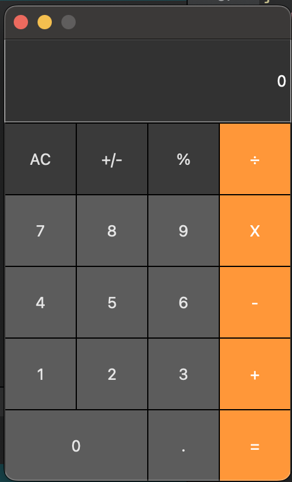

# CalculatorGUI
Project started Sep 21, 2023 @ 3:00 PM CST
This is a calculator program I created using QT Creator. The calculator serves to understand how a standard calculator work and implementing standard operators. (+.-./,X) It can also add decimal numbers

